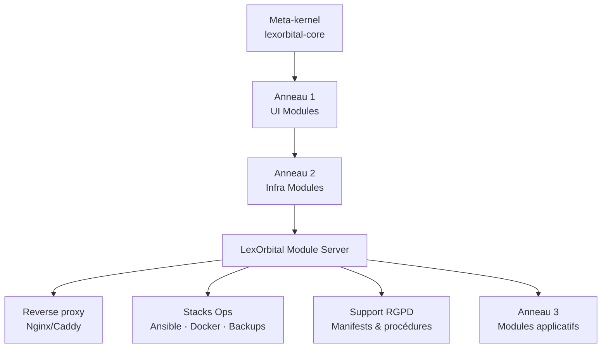
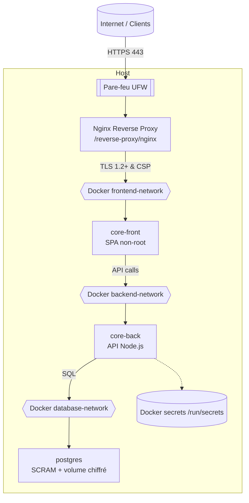
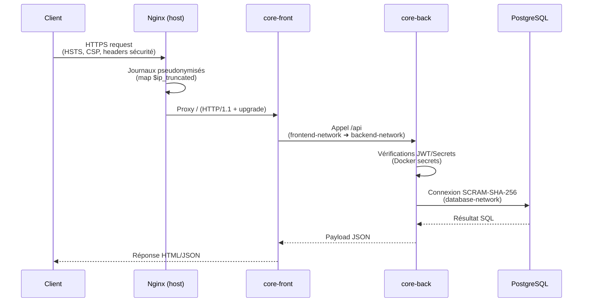
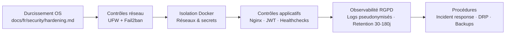

# Blueprint Architecture & Sécurité

> **Synthèse visuelle** de l'architecture serveur, des couches de sécurité et des flux critiques du module `lexorbital-module-server`.

Ce blueprint consolide les informations dispersées dans `docs/fr/architecture`, `reverse-proxy/`, `docker/` et `manifests/` pour offrir un socle de travail aux architectes et administrateurs.

---

## 1. Vue orbitale du module

**Lecture rapide**
- Anneau 2 fournit le socle sécurisé pour les anneaux supérieurs.
- Le module serveur expose uniquement des points d'entrée mutualisés (reverse proxy + webhooks).
- Les artefacts de conformité (`manifests/rgpd-manifest.json`) sont versionnés au même niveau que le code.

---

## 2. Architecture serveur conteneurisée

**Points clés tirés de `docker/docker-compose.prod.yml.example`**
- Réseaux dédiés (`internal: true` sur backend/database).
- Containers non-root, redémarrage automatique, healthchecks et `security_opt: no-new-privileges`.
- Secrets critiques injectés via Docker Swarm (`/run/secrets`).

---

## 3. Flux de requêtes et contrôles

**Contrôles attachés**
- Reverse proxy (`reverse-proxy/nginx/sites-available/lexorbital.conf`) applique TLS, CSP, HSTS, headers RGPD et expose `/health`.
- Logs : format `rgpd` défini dans `reverse-proxy/nginx/nginx.conf` avec corrélation `request_id`.
- Front et back ne publient aucun port public ; seuls les réseaux Docker permettent la communication latérale.

---

## 4. Couches sécurité & conformité

- Couche OS : provisioning Ansible (`ansible/playbooks/site.yml`) amorce mises à jour, packages essentiels et timezone.
- Couche réseau : `docs/fr/security/firewall-rules.md` impose deny par défaut + ports essentiels.
- Couche container : `docker/docker-compose.prod.yml.example` limite CPU/RAM et interdit les privilèges supplémentaires.
- Couche conformité : `manifests/rgpd-manifest.json` décrit finalité, base légale, rétention et mesures techniques.
- Couche opérations : scripts `deploy/`, `backup/` et procédures `docs/fr/security/incident-response.md`.

---

## 5. Procédure rapide d'audit architecture

1. **Provisionnement** – exécuter `ansible/playbooks/site.yml` pour valider mises à jour, packages et UFW (`ansible/roles/base/tasks/main.yml`).
2. **Reverse proxy** – vérifier `reverse-proxy/nginx/nginx.conf` (logs RGPD, TLS 1.2+) puis chaque vhost `sites-available/*.conf`.
3. **Docker & réseaux** – relire `docker/docker-compose.prod.yml.example`, confirmer réseaux internes et `security_opt`.
4. **Secrets & RGPD** – croiser `docker secrets` utilisés avec la matrice `manifests/rgpd-manifest.json`.
5. **Journalisation** – s'assurer que les règles logrotate/journald documentées dans `docs/fr/security/hardening.md` sont appliquées.
6. **Plan de réponse** – valider que les runbooks `docs/fr/security/incident-response.md` et `docs/fr/operations/backup-recovery.md` sont à jour.

Chaque itération doit être tracée (date, reviewer, écart) dans un journal d'audit interne.

---

## 6. Bonnes pratiques observées

- **Reverse proxy durci** – `reverse-proxy/nginx/sites-available/lexorbital.conf` combine HSTS, CSP, `Permissions-Policy`, tronquage IP et redirections HTTP→HTTPS.
- **Format de logs RGPD** – `reverse-proxy/nginx/nginx.conf` définit `map $remote_addr $ip_truncated` et `log_format rgpd` avec `request_id`.
- **Isolation Docker stricte** – `docker/docker-compose.prod.yml.example` n'expose aucun port backend/DB et force `internal: true` sur `database-network`.
- **Secrets Swarm** – utilisation native de `docker secret` pour DB, JWT et clés API.
- **Documentation conformité** – `manifests/rgpd-manifest.json` décrit finalité, base légale, rétention et mesures techniques (article 32).
- **Procédures d'exploitation** – guides exhaustifs (`docs/fr/operations/deployment.md`, `docs/fr/security/hardening.md`) couvrent installation, patching, monitoring et DRP.

---

## 7. Retours critiques & pistes d'amélioration

1. **Rôle Ansible minimal** – `ansible/roles/base/tasks/main.yml` ouvre encore le port SSH 22 alors que tout le reste du corpus préconise un port personnalisé `XXXXX`. Ajouter une variable `ssh_port` et aligner la règle UFW + Fail2ban.
2. **Rôles inexistants vs documentation** – `docs/fr/architecture/infrastructure.md` annonce des rôles `docker`, `nginx`, `security`, `certbot`, mais seul `roles/base` est versionné. Formaliser ces rôles pour conserver la traçabilité IaC.
3. **Manque de diagrams versionnés** – `docs/fr/architecture/diagrams/README.md` marque tous les visuels comme "à créer". Ce blueprint comble partiellement le vide, mais il faudrait exporter des SVG ou intégrer PlantUML/PNG pour les livrables.
4. **Supervision centralisée** – aucun stack de métrologie (Prometheus, Grafana, ELK) n'est défini dans `docker/` ni documenté. Ajouter un module d'observabilité ou des hooks vers une stack existante renforcerait les capacités SOC.
5. **Automatisation RGPD** – la pseudonymisation Nginx est faite côté host, mais les logs applicatifs (backend/frontend) ne sont pas couverts. Ajouter des middleware côté app ou un sidecar de redaction garantirait une conformité bout en bout.
6. **Revues de configuration** – `reverse-proxy/nginx/sites-available/lexorbital.conf` contient encore des TODO (`'unsafe-inline'` dans CSP). Planifier une tâche pour CSP strict + introduction d'un mécanisme de nonce.

---

**Mainteneur :** merci de mettre à jour ce blueprint à chaque nouvelle version majeure afin d'assurer une lecture unique de l'architecture et des contrôles de sécurité.
